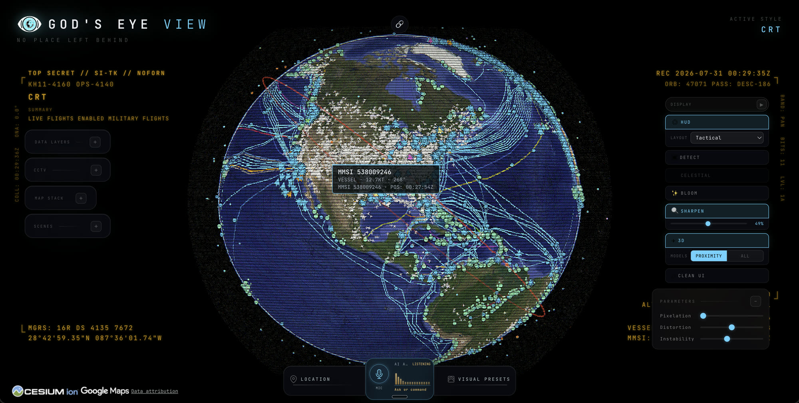
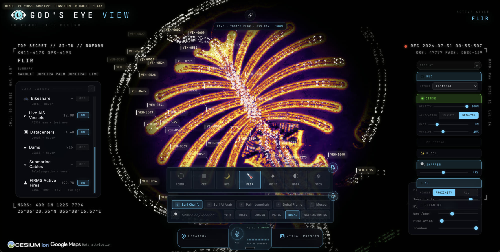
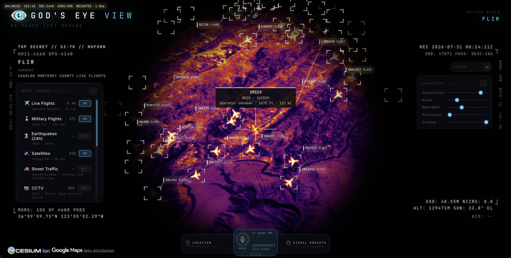
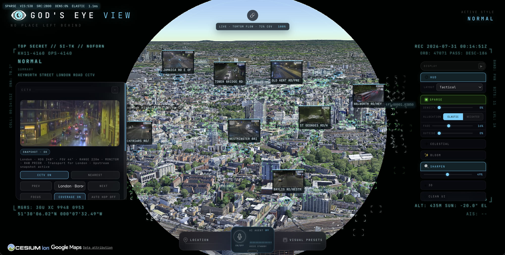
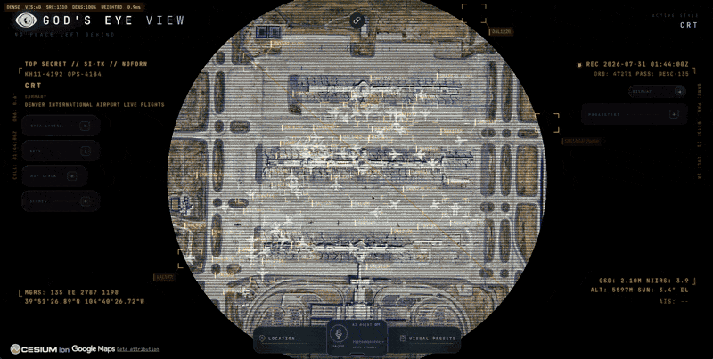

# God's Eye View

From the project behind the viral God's Eye View series, formerly known as WorldView.

  
  

  
  

You asked, so it's happening. Code is being prepared for public release.

**Updates**

- **Jul 30, 2026** — launch date set: August 18, 2026
- **Jun 22, 2026** — placeholder repo created

⭐ Star this repo. Get notified by email via [Map the World](https://maptheworld.ai/).

---

Live open source spatial intelligence on a photorealistic 3D globe. Half the magic is that it feels like a forbidden cockpit — then you realize the sources are public and the code is inspectable.

▶️ Watch the video series [[5M+ on YouTube](https://youtube.com/playlist?list=PL6qSg2I-7_koPbDnSMo0QeeHX_RknA2uv&si=nBGYMoHWQw41v93Q); [25M+ on Socials](https://www.google.com/search?q=god%27s+eye+view)].

